<div align="center">


<a href="https://git.io/typing-svg"></a>

<br/>


<br/>

[**🎨 Browse Designs**](#-purpose-based-styles) &nbsp;•&nbsp; [**⚡ Quick Start**](#-quick-start) &nbsp;•&nbsp; [**🤝 Contribute**](#-contributing)

</div>

<br/>

## ⚡ Quick Start

```bash
# 1. Create a repo named exactly like your username
# 2. Pick a style below and copy its README.md
# 3. Replace the placeholder
sed -i 's/YOUR_USERNAME/your-github-name/g' README.md
# 4. Commit. Your profile is live. 🚀
```

> 💡 Or click **[Use this template](../../generate)** to get your own copy.

<br/>

## 🎯 Purpose-based Styles

<table align="center">
  <tr>
    <td align="center" width="20%"><a href="./creative">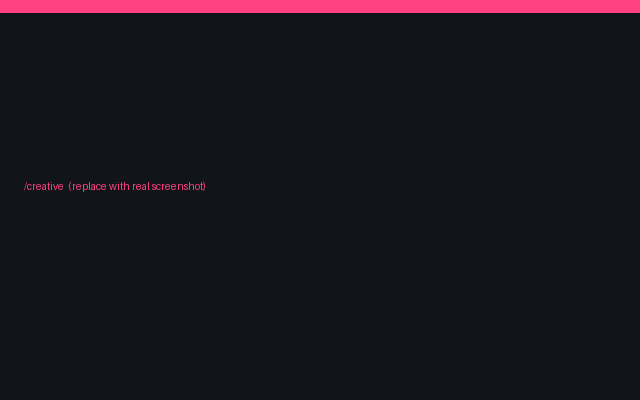<br/><b>/creative</b></a><br/><sub>Unique visuals</sub></td>
    <td align="center" width="20%"><a href="./technical">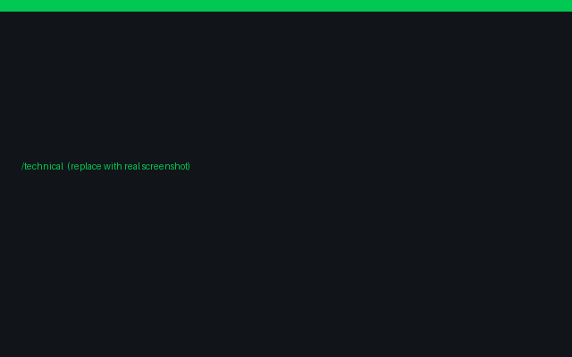<br/><b>/technical</b></a><br/><sub>Stack & tools</sub></td>
    <td align="center" width="20%"><a href="./hiring"><br/><b>/hiring</b></a><br/><sub>For recruiters</sub></td>
    <td align="center" width="20%"><a href="./opensource">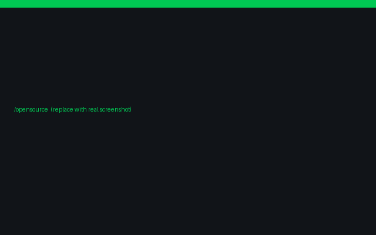<br/><b>/opensource</b></a><br/><sub>Contributions</sub></td>
    <td align="center" width="20%"><a href="./minimal">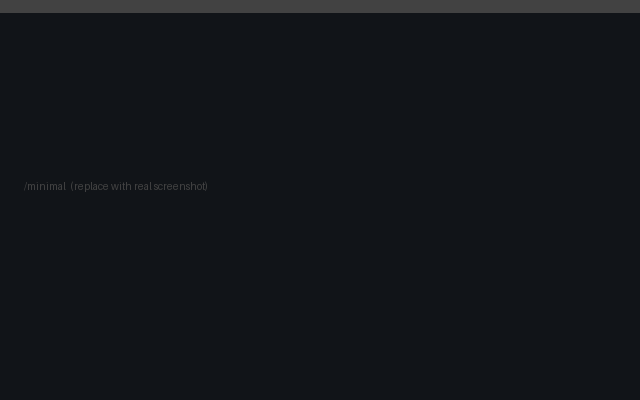<br/><b>/minimal</b></a><br/><sub>Clean & focused</sub></td>
  </tr>
  <tr>
    <td align="center" width="20%"><a href="./animated">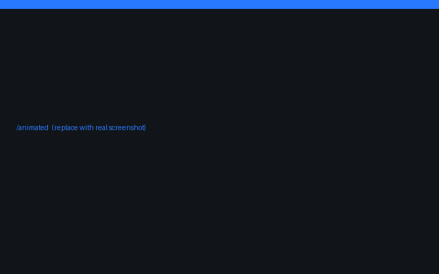<br/><b>/animated</b></a><br/><sub>Motion & life</sub></td>
    <td align="center" width="20%"><a href="./student">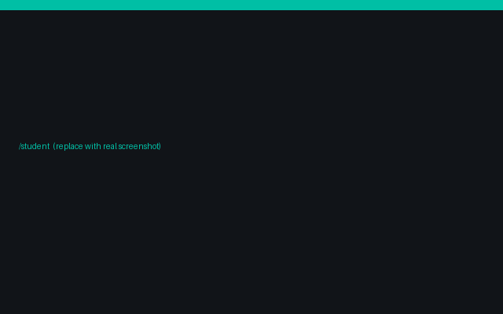<br/><b>/student</b></a><br/><sub>Beginners</sub></td>
    <td align="center" width="20%"><a href="./freelancer">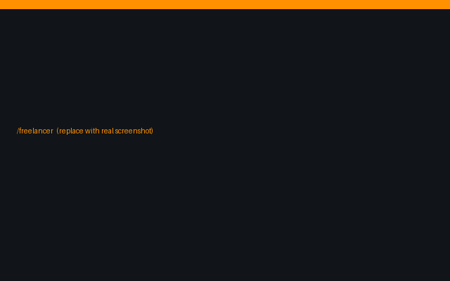<br/><b>/freelancer</b></a><br/><sub>Services & contact</sub></td>
    <td align="center" width="20%"><a href="./designer">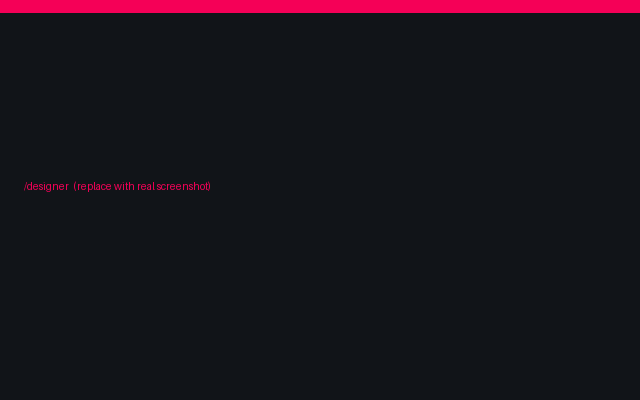<br/><b>/designer</b></a><br/><sub>UI/UX look</sub></td>
    <td align="center" width="20%"><a href="./data-science">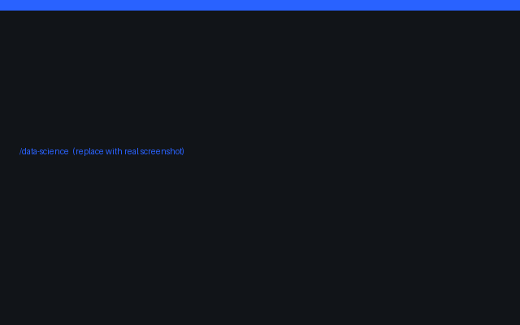<br/><b>/data-science</b></a><br/><sub>Charts & ML</sub></td>
  </tr>
</table>

<br/>

## 🎨 Vibe-based Styles

<table align="center">
  <tr>
    <td align="center" width="20%"><a href="./terminal">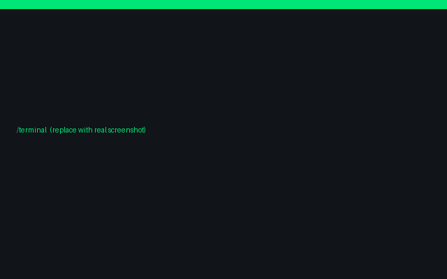<br/><b>/terminal</b></a><br/><sub>whoami</sub></td>
    <td align="center" width="20%"><a href="./neon">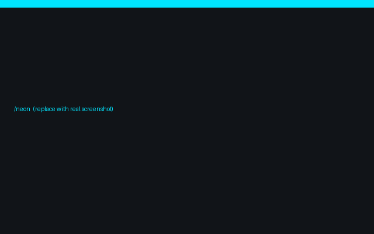<br/><b>/neon</b></a><br/><sub>Glow in the dark</sub></td>
    <td align="center" width="20%"><a href="./retro">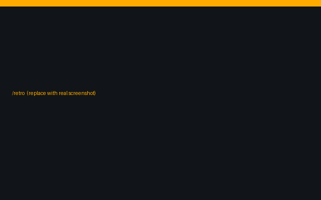<br/><b>/retro</b></a><br/><sub>8-bit pixel</sub></td>
    <td align="center" width="20%"><a href="./cyberpunk">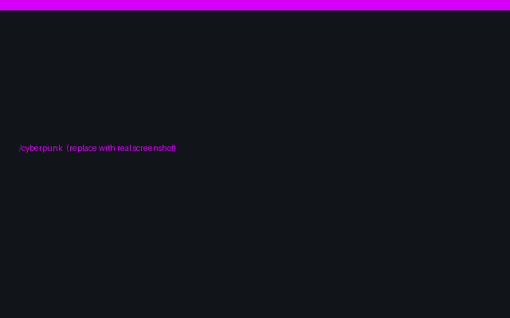<br/><b>/cyberpunk</b></a><br/><sub>Purple & pink</sub></td>
    <td align="center" width="20%"><a href="./space">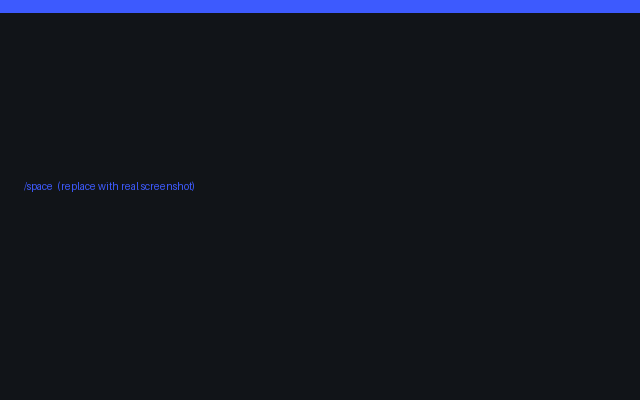<br/><b>/space</b></a><br/><sub>Galaxy theme</sub></td>
  </tr>
  <tr>
    <td align="center" width="20%"><a href="./glass">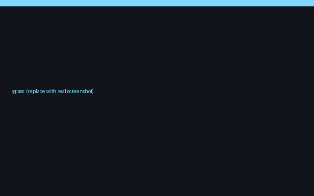<br/><b>/glass</b></a><br/><sub>Glassmorphism</sub></td>
    <td align="center" width="20%"><a href="./pastel">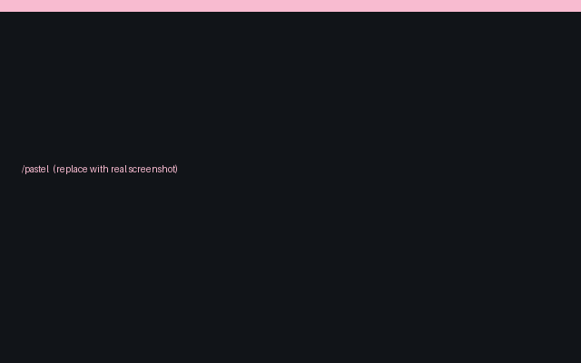<br/><b>/pastel</b></a><br/><sub>Soft & cute</sub></td>
    <td align="center" width="20%"><a href="./blueprint">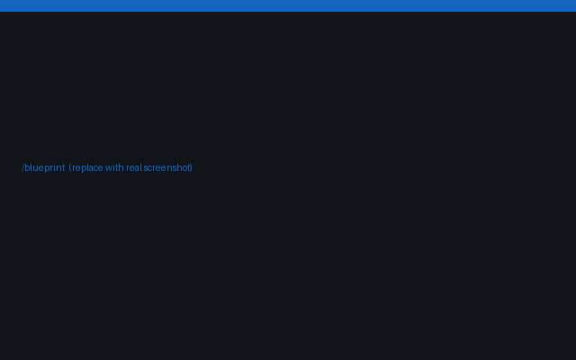<br/><b>/blueprint</b></a><br/><sub>Engineering grid</sub></td>
    <td align="center" width="20%"><a href="./matrix">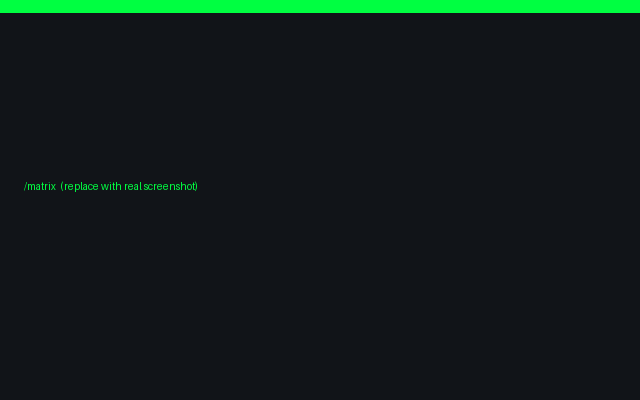<br/><b>/matrix</b></a><br/><sub>Code rain</sub></td>
    <td align="center" width="20%"><a href="./luxury">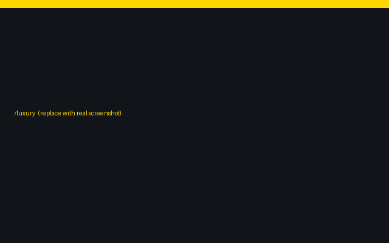<br/><b>/luxury</b></a><br/><sub>Black & gold</sub></td>
  </tr>
</table>

<br/>

## 📁 Inside every design

```text
design-name/
├── 📄 README.md      → profile code to copy
├── 🛠️ SETUP.md       → what to replace, step by step
├── 🖼️ preview.png    → screenshot
├── 🎞️ assets/        → banners, GIFs, icons
└── ⚙️ .github/workflows/ → optional GitHub Action (already in the right place)
```

<details>
<summary><b>🔧 Which designs use workflows?</b></summary>

<br/>

| Workflow | Used in |
|:--|:--|
| 🐍 Snake animation | `creative` · `animated` · `neon` · `retro` · `space` · `matrix` |
| ⏱️ WakaTime weekly stats | `technical` · `student` · `data-science` · `terminal` · `blueprint` · `matrix` |
| 🏆 GitHub trophies | `creative` · `hiring` · `opensource` · `student` · `freelancer` · `designer` · `retro` · `cyberpunk` · `pastel` · `matrix` · `luxury` |
| 📈 Activity graph | `technical` · `opensource` · `space` · `matrix` |

> ℹ️ Each design folder mirrors a complete profile repo, so `.github/workflows/` is already inside it.
> Copy the **whole folder contents** to your profile repo root and the workflow works there.
> (Workflows inside these folders do not run in this vault repo itself, only in your copy.)

</details>

<details>
<summary><b>❓ FAQ</b></summary>

<br/>

**How do I make a profile README?**
Create a public repo named exactly like your username and add a `README.md`.

**Can I edit a design?**
Yes, it's MIT licensed. Change anything.

**Stats not showing?**
Make sure you replaced `YOUR_USERNAME`.

</details>

<br/>

## 🤝 Contributing

Made a new style? Send a PR! Read [CONTRIBUTING.md](./CONTRIBUTING.md) for the folder format.

<div align="center">

<br/>

**Made with 💚 for developers who build on purpose.**

⭐ If this helped, drop a **star**!


</div>
