 

---

## ⚡ PROFILE

| | |
|:---|:---|
| 👤 **Name** | Rishabh |
| 💼 **Role** | Frontend Developer |
| 🔥 **Passion** | Building clean, responsive UIs |
| 🌱 **Learning** | Node.js + Express (Backend) |
| 🤝 **Open To** | Collaborations & Open Source |
| 💬 **Ask Me** | Web Dev · React · UI/UX |

---

## 🧑‍💻 ABOUT ME

> *I'm a self-taught frontend developer who fell in love with the web in 2023 and hasn't looked back since.*
> React is my weapon of choice, Tailwind keeps me sane, and coffee keeps me alive. I gravitate toward UI-heavy projects and developer tools. Currently on a journey into the backend with Node.js + Express, because full-stack feels like the final boss. I believe great UI isn't just pretty pixels; it's empathy compiled into code.

---

## 🛣️ CURRENTLY LEARNING

→

→

→

→

---

## 🧠 TECH STACK

---

## 📊 GITHUB STATS

  

&nbsp;

---

## 📈 LIVE ACTIVITY GRAPH

---

## 🏆 ACHIEVEMENT TROPHIES

---

## 🌐 CONNECT

*Open to collaborations, freelance work & full-time opportunities*

